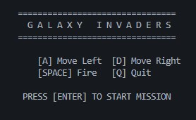
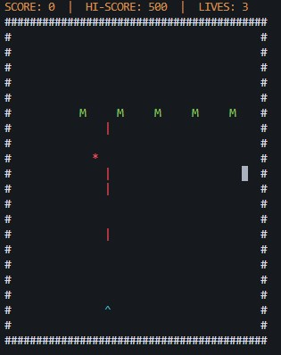

# Galaxy Invaders 🚀



A terminal-based replica of the classic Space Invaders game, written in **Pure C** for the first-year Engineering Project at BMSCE.

This project demonstrates core programming concepts including **Structures**, **Pointers**, **Arrays**, **File I/O**, and **Modular Architecture**.

## 🎮 Features
* **Smooth Rendering:** Uses a double-buffer system to eliminate screen flickering.
* **Color Graphics:** Implements ANSI escape codes and Windows API for colorful visuals.
* **Persistent High Score:** Saves your best score to a file (`highscore.txt`) so it remains after closing the game.
* **Enemy AI:** Aliens patrol the screen and randomly fire projectiles back at the player.
* **Modular Code:** Logic, Rendering, and Entities are separated into different files for clean architecture.

## 🛠️ Tech Stack
* **Language:** C (C99 Standard)
* **Platform:** Windows (Uses `<windows.h>` for cursor control and `<conio.h>` for input)
* **Graphics:** ASCII / Terminal-based


## 👾 Gameplay


## 🚀 How to Run

### Prerequisites
You need a C compiler installed (GCC via MinGW or TDM-GCC).

### Compilation
Open your terminal in the project folder and run:
```bash
gcc main.c renderer.c logic.c storage.c -o game

```

### Start Game

```bash
game

```

## 🕹️ Controls

* **[A]** - Move Left
* **[D]** - Move Right
* **[SPACE]** - Fire Laser
* **[Q]** - Quit Game

## 📂 Project Structure

* `main.c` - The entry point and game loop.
* `entities.h` - Struct definitions for Player, Aliens, and Bullets.
* `renderer.c` - Handles screen drawing and color logic.
* `logic.c` - Handles collision detection, movement, and input.
* `storage.c` - Handles File I/O for saving high scores.

```

---

### 2. The `requirements.txt`
Since C compiles to a standalone `.exe`, this file is mostly just to tell other devs what environment they need. Paste this in:

```text
SYSTEM REQUIREMENTS
===================
Operating System: Windows 10 or 11
(Note: This project uses <windows.h> and <conio.h> which are Windows-specific)

BUILD TOOLS
===========
Compiler: GCC (MinGW-w64 recommended) or TDM-GCC
Build System: Command Line / Terminal

LIBRARIES
=========
Standard C Libraries used:
- <stdio.h> (Input/Output)
- <stdlib.h> (Memory & Random)
- <windows.h> (Console Cursor & Colors)
- <conio.h> (Non-blocking Input)

```